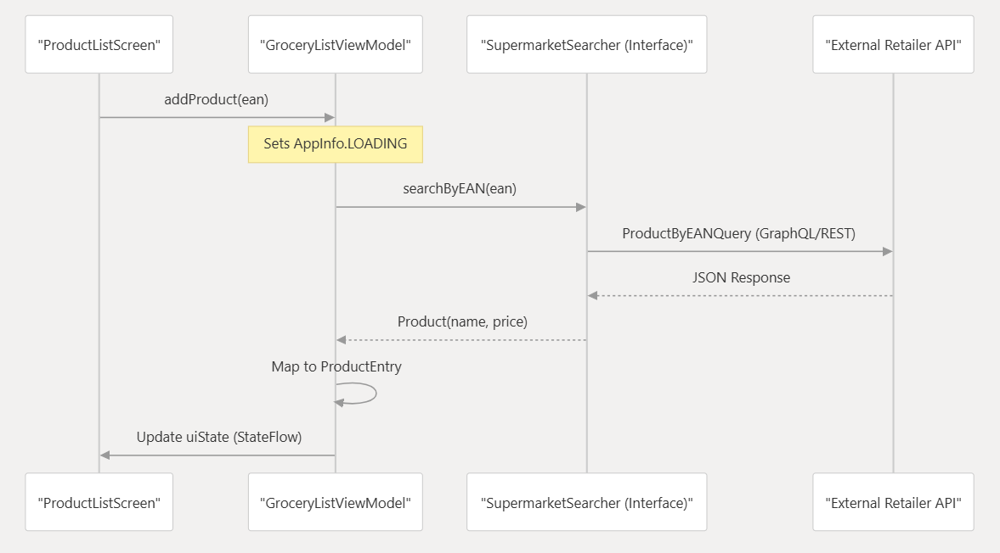

# CompraLista

CompraLista es una aplicación ligera para Android diseñada para simplificar la compra de alimentos mediante la consulta de precios en tiempo real y la gestión de listas de la compra locales. La aplicación permite a los usuarios mantener varias listas de la compra organizadas por supermercado, escanear códigos de barras para obtener información de los productos (nombres y precios) directamente de las API de los supermercados y comparar precios entre diferentes establecimientos.

Desarrollada con prácticas modernas de desarrollo para Android, la aplicación destaca por su interfaz limpia de Material Design 3 con colores dinámicos y flujos de datos reactivos.

## Características principales

* Escaneo de códigos de barras: Funcionalidad de escaneo integrada para agregar productos al instante mediante códigos EAN
* Búsqueda en múltiples supermercados: Permite obtener información de productos de grandes minoristas como Olímpica (mediante GraphQL) y Éxito (mediante REST/GraphQL)
* Comparación de precios: Un flujo de trabajo específico para escanear un producto y ver su precio actual en todos los buscadores de supermercados configurados
* Almacenamiento local: Almacenamiento sin conexión robusto mediante Room para listas, entradas de productos y estados del carrito
* Gestión del carrito: Cálculo del subtotal en tiempo real para los artículos marcados como "en el carrito" en comparación con el valor total de la lista

## Arquitectura

CompraLista implementa una arquitectura *MVVM* (Model-View-ViewModel) con capa de Repositorio, siguiendo el principio de Flujo de Datos Unidireccional (UDF). Esta decisión arquitectónica permite separar claramente las responsabilidades: la UI observa estados inmutables, los ViewModels procesan lógica de negocio y el Repositorio abstrae el origen de los datos, ya sea persistencia local o APIs externas.

```
┌─────────────────────────────────────────┐
│              UI Layer                   │
│  Jetpack Compose + Material Design 3    │
│  • OverviewListScreen                   │
│  • ProductListScreen                    │
│  • ComparePriceScreen                   │
│  • AddNewListScreen                     │
└────────────────┬────────────────────────┘
                 │ observe(uiState: StateFlow<AppInfo>)
                 ▼
┌─────────────────────────────────────────┐
│           ViewModel Layer               │
│  • GroceryListViewModel                 │
│  • SupermarketListViewModel             │
│  • StateFlow<AppInfo> como fuente única │
└────────────────┬────────────────────────┘
                 │ delega operaciones
                 ▼
┌─────────────────────────────────────────┐
│           Repository Layer              │
│  OfflineEntriesRepository               │
│  • Transformación de datos              │
│  • Coordinación entre fuentes           │
└───────────────┬─────────────────────────┘
                │
    ┌───────────┴───────────┐
    ▼                       ▼
┌─────────┐       ┌─────────────────┐
│  Room   │       │  Supermarket    │
│Database │       │  Searchers      │
├─────────┤       ├─────────────────┤
• Entry   │       • OlimpicaSearcher│
• DAOs    │         (Apollo GraphQL)│
• Entities│       • ExitoSearcher   │
└─────────┘         (Retrofit REST) │
                  └─────────────────┘
```

### Datos
#### Modelo de dominio
Las entidades centrales (Product, ProductEntry, SupermarketList) definen el lenguaje del dominio de compras. ProductEntry, por ejemplo, encapsula no solo los datos del producto sino también su estado dentro de una lista específica (cantidad, precio congelado, marca de "en carrito").
#### Room como fuente de verdad local
La base de datos Room (EntryDatabase) actúa como caché de escritura y fuente primaria para datos. Los DAOs exponen consultas como Flow<List<ProductEntry>>, permitiendo que la UI observe los cambios necesarios.



## Componentes e interfaces clave

### Acceso a datos (Repositorio)
La interfaz EntriesRepository actúa como fuente única de información para listas de la compra y entradas de productos. Utiliza Kotlin Flow para proporcionar flujos de datos reactivos desde la base de datos local.

### Buscadores de supermercados
La aplicación abstrae la lógica de la API específica de los supermercados mediante un patrón de búsqueda. La enumeración AllSupermarketSearcher funciona como un registro, lo que permite a la aplicación seleccionar dinámicamente la implementación correcta (por ejemplo, OlimpicaSearcher o ExitoSearcher) según el supermercado asociado a una lista.

### Navegación
La navegación se gestiona mediante NavHost en MainActivity. Define las rutas para la pantalla de inicio, la creación de listas, la visualización de productos y la comparación de precios.

La inyección de dependencias se realiza de forma manual mediante AppContainer, lo que proporciona transparencia en el grafo de dependencias sin añadir complejidad de frameworks externos. Cada capa depende únicamente de abstracciones (interfaces), facilitando el testing y la evolución del código

```
OverviewListScreen (ruta: "/")
       │
       ├── [Nueva Lista] ──► AddNewListScreen (ruta: "/add")
       │
       ├── [Seleccionar Lista] ──► ProductListScreen (ruta: "/list/{listId}")
       │                              │
       │                              ├── [Escanear] ──► (integración cámara)
       │                              │
       │                              └── [Comparar] ──► ComparePriceScreen (ruta: "/compare")
       │
       └── [Comparar Precios] ──► ComparePriceScreen
```


| Componente | Tecnología / Configuración |
|---|---|
| Lenguaje | Kotlin |
| UI Framework | Jetpack Compose (Material Design 3) |
| Arquitectura | MVVM + Repository + UDF |
| Networking | Apollo Kotlin (GraphQL) & Retrofit (REST) |
| Persistencia | Room Database con Coroutines |
| Concurrencia | Kotlin Coroutines & Flow |
| Inyección de Dep. | Inyección vía AppContainer |
| Escaneo de Barras | barcode-scanner |
| Min SDK | 24 (Android 7.0) |
| Compile SDK | 35 |


> Diseñado con principios de arquitectura limpia: Cada módulo tiene una responsabilidad única, las dependencias fluyen hacia adentro, y los detalles externos (APIs, base de datos) se intercambian mediante abstracciones. Este enfoque permite evolucionar la aplicación con confianza, añadiendo nuevos supermercados o características sin reescribir el núcleo

---

# Participantes
* Fernando González Rivero
* Isabela Arrubla Orozco
* Nicole Yuqui Vasquez


