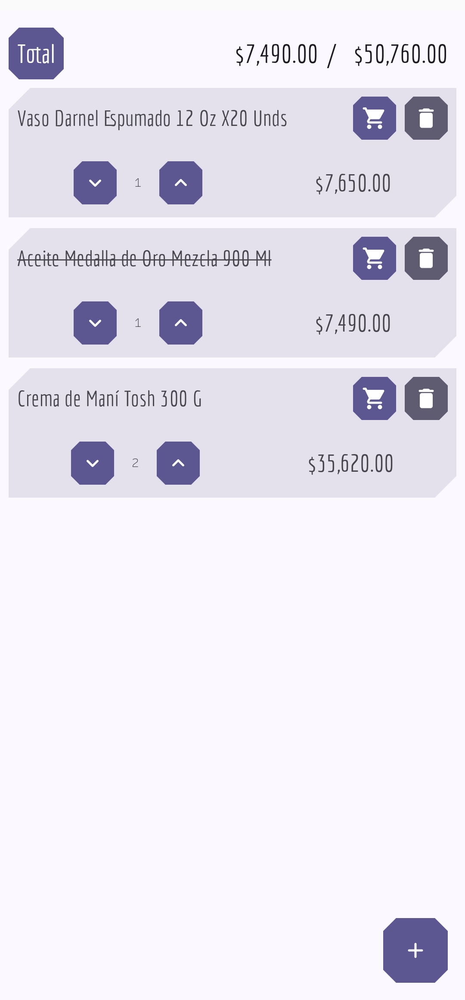

# CompraLista

An extremely simple Material Design groceries app that retrieves product info from [Olimpica](https://www.olimpica.com/)'s GraphQL API.

This project is mostly a means for me to learn some Android Development, while still being a somewhat useful product.

## Features
* Scan barcode to add product.
* Set different product quantities.
* "Add to cart" and see the total price of the products in the cart.
* Delete products that you no longer want to buy.
* Animations & Material Theme's dynamic coloring

## Screenshots

